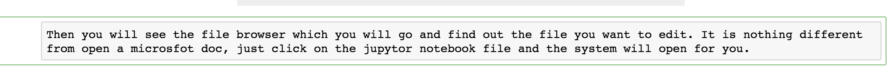

# Jupytor Notebook Quick Guide

In order to open the '.ipynb' file which is the jupytor notebook file, first you need to download the anaconda-Navigator which can be downloaded [here](https://docs.anaconda.com/anaconda/install/). Also, Anaconda provides its own version of cheat sheet so I won't spend more time working on it. The cheat sheet of basic features of anaconda navigator can be found [here](https://docs.anaconda.com/_downloads/9ee215ff15fde24bf01791d719084950/Anaconda-Starter-Guide.pdf).

## Open the file

After you sucessfully install the app on your device, you will find several apps available for you. What you want to open is the jupytor notebook app.

Then you will see the file browser which you will go and find out the file you want to edit. It is nothing different from open a microsfot doc, just click on the jupytor notebook file and the system will open for you.

## Additional help for people who are not familiar with git :Download the jupytor notebook from Github

First, you will see many different project repos in the broader repository(click on the picture to open the website if you are not part of the organization yet). The content creaters put the original version of jupytor notebook in those repos.

Open those repos so you can download them as a zip file.

## Edit the content

Then you can start to edit in the notebook. At the beginning you will see no place for you to edit because the text looks like this:

---

---

Don't worry, just double click on the texts, then it will be showing up like this:

---

---

Then feel free to edit it. After you are finished with all the contents in the cell, press "control + return" if you are using mac os system /press "control + enter" if you are using windows to end editing.

When you are done with all the cells, make sure you save it before close.

## Upload the file

### For git users, please check the work flow [here](https://github.com/Analytics-at-Sauder/Workflow/blob/master/Work%20Flow.md) to upload it in a more efficient way

After you get your jupytor notebook ready, go back to the page where you downloaded the notebook. You can see the button which let you upload the file there:

Then simply drag the changed file into the big box:

You file is now successfully uploaded to github!
