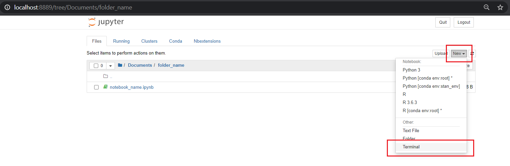
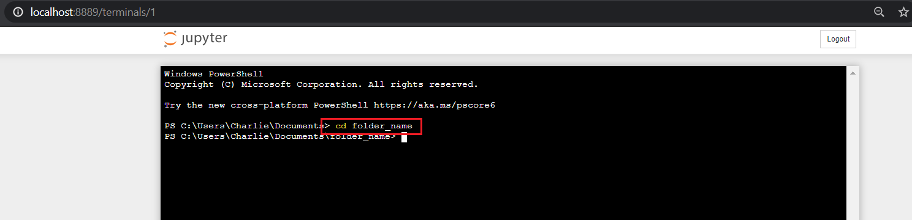
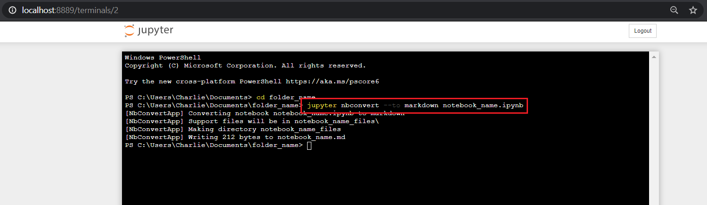
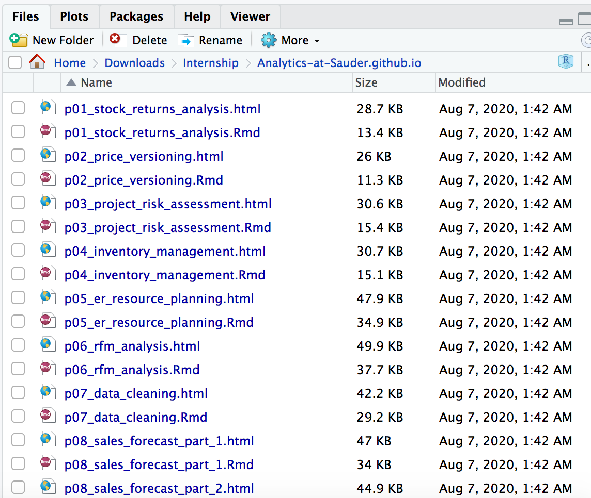
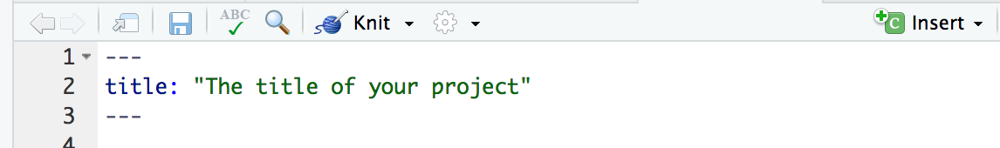
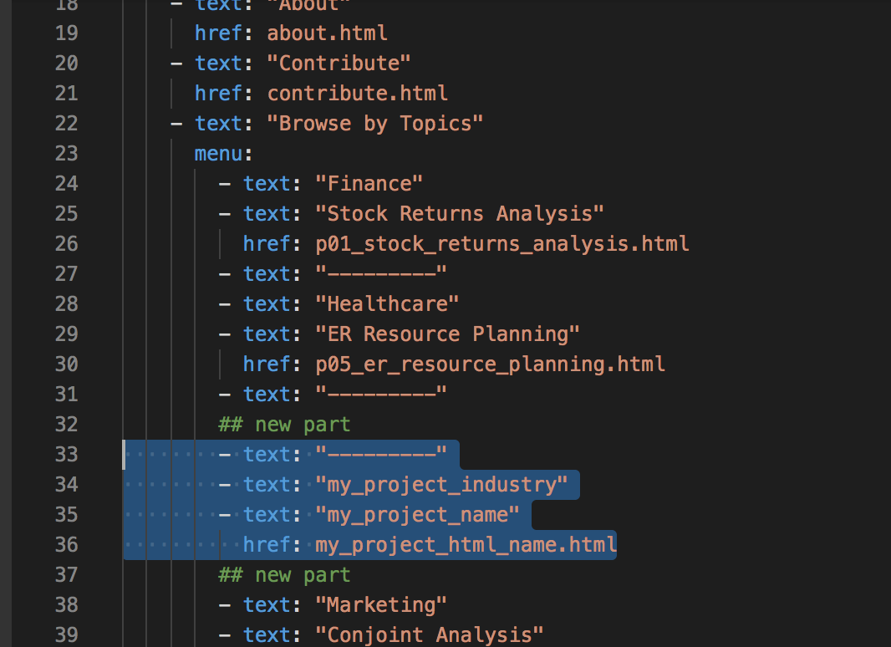
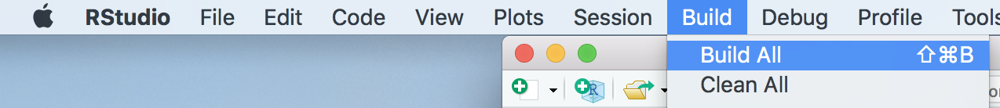
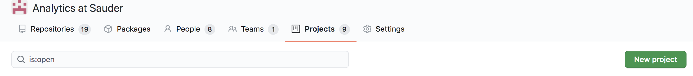
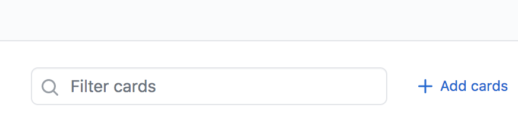
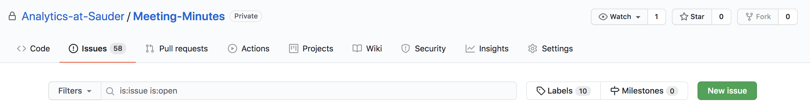

# How to create a new project?

### Step 1: Download the [Notebook Template](https://github.com/Master-of-Business-Analytics/Notebooks_and_Data/blob/master/JupyterNotebook_Template.ipynb)

Make sure that your project follows the instruction of the template so all the projects will have a similar format and will look nice and clean

### Step 2 : Convert you Jupyter Notebooks to Markdown and into the Website repository

- Once you finished editing you Jupyter Notebook, save it as a Markdown file using the terminal (do not do it directly within the Notebook otherwise the images would not be automatically organized in a sub-folder.

  

- Change the working directory to the folder where your Notebook is located by typing `cd folder_name` and hitting 'Enter'. `cd` stands for 'change directory, and 'folder_name' would be different depending on where you put your Jupyter Notebook.

  

- Save your Jupyter Notebook as a Markdown file (and put any output images in a sub-folder) by typing `jupyter nbconver --to markdown notebook_name.ipynb` and hitting 'Enter'. Again, 'notebook_name' would be different depending on how you named your Jupyter Notebook

  
  
- Convert all .ipynb to .md in one go using command line

    - Case 1: All notebooks are in one folder
    
      Let’s say this folder is named “notebooks” and is on your desktop. So its path is `~/Documents/notebooks` 
      
      Run the following command:
      
      ```shell
      jupyter nbconvert --output-dir='~/Documents/md_files' --to markdown ~/Documents/notebooks/*.ipynb
      ```
      
      `output-dir='~/Desktop/md_files’` tells nbconvert where to store the output. 
       
       Here, we are storing it in a folder named `md_files` on Desktop. 
       
       The folder `md_files` will be automatically created if it does not already exist.
       
       `~/Desktop/notebooks/*.ipynb` will select all files with .ipynb extension in the “notebooks” folder 

## Case 2: Notebooks are in different folders
If you have notebooks stored within folders named “project_1” and “project_2” on your desktop, this will work:
```shell
jupyter nbconvert --output-dir='~/Desktop/md_files' --to markdown ~/Desktop/project_*/*.ipynb
```
* `~/Desktop/project_*/*.ipynb` looks for all folders that start with name `project_` on your desktop, and looks for all `.ipynb` files within those folders


### Step 3: Integrate the rmd with the existing project

- In this step, you need to work with the newest version of the existing project. You can get it with git code here:

  ```
  git clone https://github.com/Analytics-at-Sauder/Analytics-at-Sauder.github.io.git
  ```

  (Before you use the git codes, make sure you use -pwd to check if you are at the correct working directory)

- Then open the project file with the Rstudio.

  
  <br/>

- After open the project, go paste your finished rmd file(which you have in step 3) into the project directory and open it again in Rstudio.

  

  For example, if your project is calld "p07_data_cleaning.Rmd", just open it by double clicking on it.

### Step 5 : Generate the html file and build the website again

- You are ready to generate the website in this step! This is actually a built-in function of Rstudio, so just go ahead and click on the "Knit" button.

  

  You will be able to see the completed version of your html file, make sure everything works as you expected.

- After confirmation, go open the "_site.yml" file that is also located within the working directory. You can also open it with visual studio.

  

- Edit the yml file based on your own need like this:

  

  If your project lies under one of the existing industry, then you don't need the first two lines, just add the last two lines under the existing industry.

- Finally, rebuild the website so all web pages are connected with each other.

  

### Step 6 : Push the change back to online repo

You can use - git push to push the changes back to online repo. The instruction can be found [here](https://github.com/Analytics-at-Sauder/Introduction-to-Git).

But here are some of the codes you might need to use:

`git status` to check the changes in the directory

`git branch "your branch name"` -- # create a new branch that represent your work

`git checkout "your branch name` -- # switch to your own branch

`git add .` means all in git codes, this add in all the changes to the git. You can also substitute . with specific file names

`git commit -m "the message"` this allow you to describe what changes you made with the file

`git push origin "your branch name"` push all the changes to master branch/ your own branch

# How to manage the project?

### Part 1 : Project Tab

- You can go to the project tab in github and create new project use "new project" button to create a new project.

  

- Then you can go into the specific project and create task card to keep trach of all the tasks. Go try it yourself you will find how to use it yourself.

  

### Part 2 : Meeting Minutes

- For the meeting minutes, you can record it with the new issue feature in the github.

  
